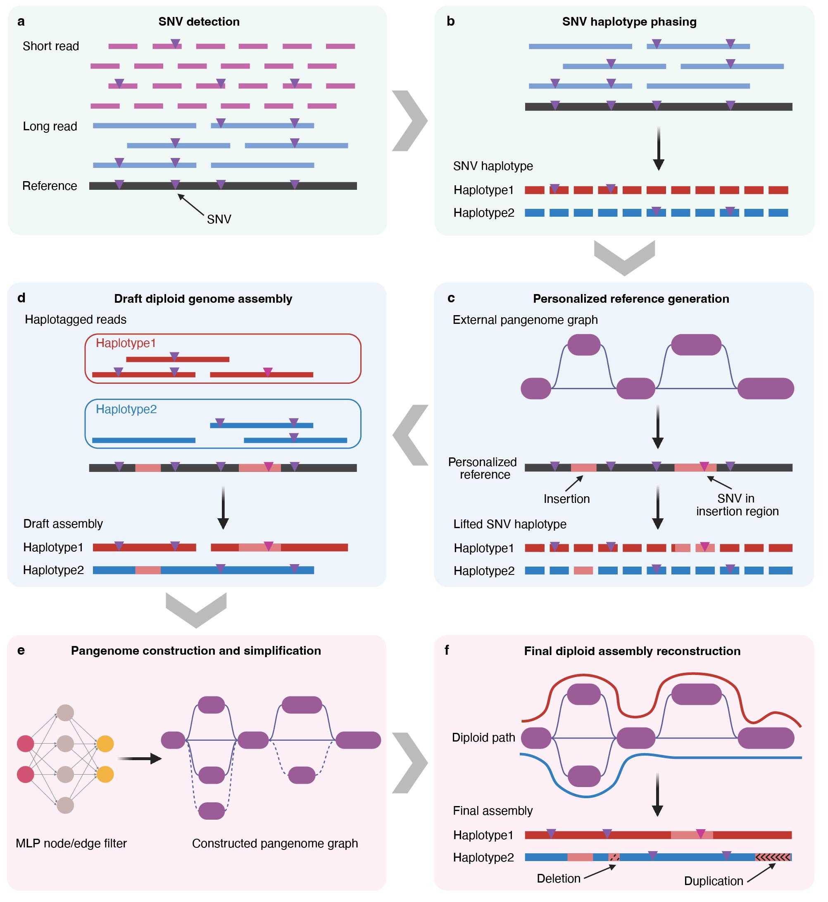

# Pangenome-Informed Genome Assembly (PIGA)
## Introduction
This is a workflow called Pangenome-Informed Genome Assembly (PIGA) for **population-scale diploid genome assembly**, which employs a pangenome graph as a unified framework to integrate sequence information across individuals and perform joint diploid genome assembly. 

Compared to the current assembly methods, the PIGA workflow fully utilizes multiple sources of information (long read, short read, internal population, external variant panels, external assembly panel) and is well adapted to low-coverage and modest-coverage situations.



## Installation
Installing PIGA and its required software with:
```bash
git clone https://github.com/JianYang-Lab/PIGA.git
conda env create -f environment.yml
```

## Documentation
The following modules are available in PIGA:

- `call_sr_snv`: detect SNVs using short reads.
- `call_lr_snv`: detect SNVs using long reads.
- `merge_snv`: merge the short-read SNV callset and long-read SNV callset.
- `phase_snv`: perform SNV haplotype phasing leveraging long-read and population information.
- `generate_personal_reference`: generate personalized reference by modifying the reference genome with homozygous variants genotyped from the external pangenome.
- `draft_assembly`: partiton long reads into haplotypes and produce draft diploid assemblies.
- `split_minigraph`: generate Minigraph pangenome and split it into subgraphs.
- `construct_pangenome`: construct and refine the base-level pangenome.
- `simplify_ml_pangenome`: simplify the pangenome.
- `merge_pangenome`: merge pangenome subgraphs into the final pangenome.
- `infer_diploid_path`: reconstruct the final diploid assembly by inferring the diploid paths.

The step-by-step documentation is available at [tutorial](#tutorial-link). If you encounter problems, please open a [github issue](#github-issue-link).

## License
**License**: MIT License

