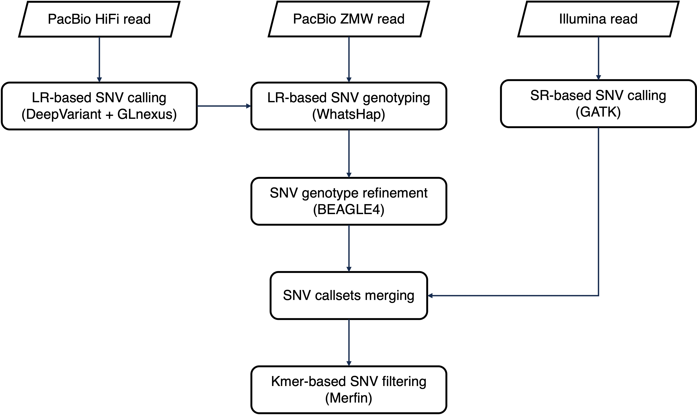

# SNV detection
This pipeline performs population-level SNV detection by leveraging PacBio long reads and Illumina short reads.



## call_sr_snv
### Description
-  Detect SNVs using Illumina reads with GATK.
### Requirement
-  BWA
-  Samtools
-  GATK
-  Bcftools
### Usage
```shell
snakemake -s Snakefile --cores 64 --configfile config/tools.yaml --configfile config/SR_var_calling.yaml
```

## call_lr_snv
### Description
-  Detect candidate SNVs using PacBio HiFi reads with DeepVariant.
-  Jointly call SNVs at the population level with GLnexus.
-  Genotype SNVs using PacBio ZMW reads with PacBio ZMW reads with WhatsHap.
-  Refine the SNV genotypes from genotype likelihood with Beagle4.
### Requirement
-  minimap2
-  DeepVariant
-  GLnexus
-  Bcftools
-  WhatsHap
-  Longshot
-  Beagle4
### Usage
```shell
snakemake -s Snakefile --cores 64 --configfile config/tools.yaml --configfile config/LR_var_calling.yaml
```

## merge_snv
### Description
-  Merge the Long-read (LR) and Short-read (SR) SNV callsets and select the SNV genotypes based on Hardy–Weinberg equilibrium P-value.
-  Filter the SNVs for each individual based on kmers from short reads and HiFi reads with Merfin.
### Requirement
-  Bcftools
-  Merfin
### Usage
```shell
snakemake -s Snakefile --cores 64 --configfile config/tools.yaml --configfile config/merge_snv.yaml
```
