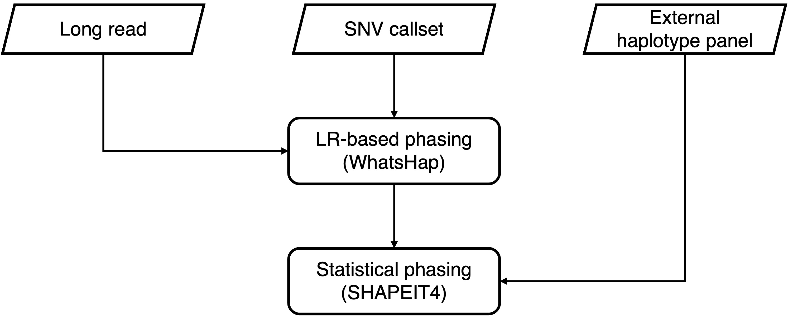

# SNV haplotype phasing

This pipeline performs SNV phasing by integrating information from long reads and population.



## phase_snv

### Description

- Generate long read-based SNV phasing blocks for each individual with WhatsHap.
- Perform statistical phasing by intergrating the prior haplotype information from long read and external haplotype panel with Shapeit4.

### Requirement

- [Bcftools](https://github.com/samtools/bcftools)
- [WhatsHap](https://github.com/whatshap/whatshap)
- [Shapeit4](https://github.com/odelaneau/shapeit4)

### Configuration (`phase_snv.yaml`)

The configuration file should contain:

**`samples`**: Specify the path to a text file listing all samples.
The file must be **space-delimited**, with:

- **Column 1:** Sample name
- **Column 2:** Sample sex

**`reference`**:

- `CHM13`: Provide the path to the **T2T CHM13 human reference genome** (FASTA format, indexed by `samtools faidx`).

**`prefix`**: Prefix used for naming output files.

**`merge_merfin_filter_vcf`** _(optional)_: Path to the merged, Merfin-filtered VCF file.
If omitted, the workflow will use the default:
`c3_merge_snv/merfin/merge/{prefix}.CHM13.consensus.phase1.call_set.hwe_missing_filter.vcf.gz`

**`zmw_bam`** _(optional)_: Path to the PacBio ZMW BAM file for each sample.
Use `{sample}` as a wildcard.
If omitted, the workflow will use the default:
`c2_call_lr_snv/lr_mapping/{sample}/{sample}.zmw.pbmm2.bam

### Usage

```bash
snakemake -s Snakefile --cores 64 --jobs 64 --configfile config/phase_snv.yaml --workflow-profile ./profile/config_slurm/
```

### Output
The output file should contain:
- **`c4_phase_snv/sample_vcf/{sample}/{sample}.shapeit.vcf.gz`**: Phased SNVs of each samples