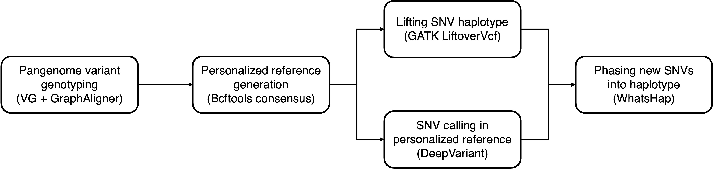

# Personalized reference generation

This pipeline generates personalized reference and SNV haplotype for each individual.



## generate_personal_reference

### Description

- Genotype variants (SNVs, indels and SVs) from the external pangenome with VG and GraphAligner.
- Generate personalized reference by modifying original reference using homozygous variants with Bcftools.
- Lift SNV haplotypes from original reference to personalized reference.
- Call SNVs for the lifted-failed regions with DeepVariant.
- Phased newly called SNV into SNV haplotypes with WhatsHap.

### Requirement

- [VG](https://github.com/vgteam/vg)
- [GraphAligner](https://github.com/maickrau/GraphAligner)
- [Bcftool](https://github.com/samtools/bcftools)
- [GATK](https://github.com/broadinstitute/gatk)
- [BWA](https://github.com/lh3/bwa)
- [DeepVariant](https://github.com/google/deepvariant)
- [WhasHap](https://github.com/whatshap/whatshap)

### Configuration (generate_personal_reference.yaml)

The configuration file should contain:

**`samples`**: Specify the path to a text file listing all samples.
The file must be **space-delimited**, with:

- **Column 1:** Sample name
- **Column 2:** Sample sex

**`sr_fastqs`**: Specify the paths to the **paired-end short-read FASTQ files**.
Use `{sample}` as a wildcard; it will be automatically replaced with sample names from the `samples` file.

**`lr_zmw_fastqs`**: Specify the path(s) to **PacBio ZMW-grouped (subreads) FASTQ files**.
Use `{sample}` as a wildcard; it will be automatically replaced with sample names from the `samples` file.

**`external_pangenome`**: Provide the path to the **external pangenome graph** (GBZ format), such as the HGSVC3/HPRC minigraph–cactus pangenome assembly.

**`reference`**:

- `CHM13`: Provide the path to the **T2T CHM13 human reference genome** (FASTA format, indexed by `samtools faidx`).

**`prefix`**: Prefix used for naming output files.

### Usage

```bash
snakemake -s Snakefile --cores 64 --jobs 64 --configfile config/generate_personal_reference.yaml --workflow-profile ./profile/config_slurm.yaml
```
