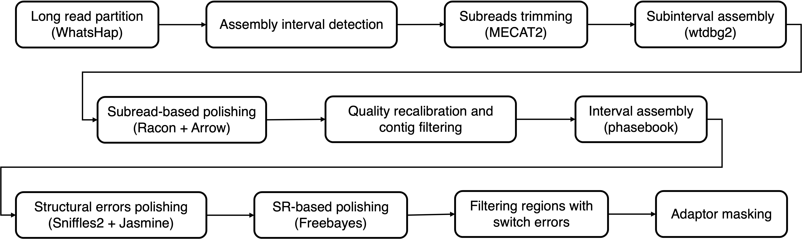

# Draft diploid genome assembly
This pipeline performs reference-guided draft diploid genome assembly.



## draft_assembly
### Description
-  Partition long reads into haplotypes with WhatsHap.
-  Detect intervals with enough partitioned long-read coverage and extract their contained reads to perform assembly.
-  Trim the subreads with MECAT2.
-  Perform subinterval assembly with wtdbg2.
-  Polish contigs using subreads with Racon and Arrow.
-  Recalibrate the base quality of contigs and filter low-quality contigs.
-  Perform interval assembly with phasebook.
-  Detect structural errors in contigs with Sniffles2 and Jasmine.
-  Polish contigs using short reads with Freebayes.
-  Filter contig regions with switch errors by comparing assembly haplotype to SNV haplotype.
-  Mask the adaptor sequences in contigs.
### Requirement
-  BWA
-  GATK
-  minimap2
-  WhatsHap
-  Samtools
-  Bcftools
-  Seqkit
-  MECAT2
-  wtdbg2s
-  Racon
-  Arrow
-  cutadapt
-  phasebook
-  Sniffles2
-  Jasmine
-  Freebayes
-  Bedtools
### Usage
```shell
snakemake -s Snakefile --cores 64 --configfile config/draft_assembly.yaml
```
