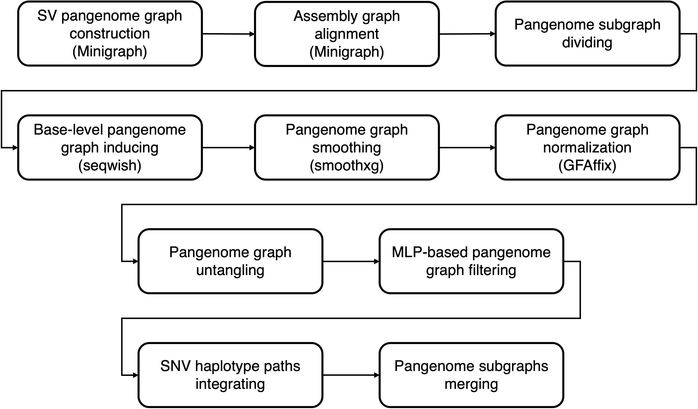

# Pangenome construction and simplification

This pipeline performs pangenome construction and simplification.



## construct_pangenome

### Description

- Construct the SV pangenome graph with minigraph.
- Align assemblies to pangenome graph with minigraph and filter the low-quality aligments.
- Divide the pangenome graph into subgraphs.
- Split alignments and assembly sequences into subgraphs.
- Induce base-level pangenome graph with seqwish.
- Smooth the pangenome graph with smoothxg.
- Normalize the pangenome graph with GFAffix.
- Clip the dna-brnn masked or minigraph unaligned regions.
- Reduce the graph complexity by untangling multiple-copy nodes among haplotypes.

### Requirement

- [minigraph](https://github.com/lh3/minigraph)
- [seqkit](https://github.com/shenwei356/seqkit)
- [VG](https://github.com/vgteam/vg)
- [cactus-gfa-tools](https://github.com/ComparativeGenomicsToolkit/cactus)
- [Samtools](https://github.com/samtools/samtools)
- [seqiwsh](https://github.com/pangenome/seqwish)
- [smoothxg](https://github.com/pangenome/smoothxg)
- [GFAffix](https://github.com/codialab/GFAffix)

### Configuration (construct_pangenome.yaml)

The configuration file should contain:

**`samples`**: Specify the path to a text file listing all samples.
The file must be **space-delimited**, with:

- **Column 1:** Sample name
- **Column 2:** Sample sex

**`reference`**:

- `CHM13`: Provide the path to the **T2T CHM13 human reference genome** (FASTA format, indexed by `samtools faidx`).
- `GRCh38`: Provide the path to the **GRCh38 reference genome** (FASTA format. Indexed by `samtools faidx`).

**`external_assembly_list`**: Specify the path to a file listing **external genome assemblies** to be included in pangenome construction.
The file must be **space-delimited**, with:

- **Column 1:** Haplotype/assembly name
- **Column 2:** Path to the haplotype/assembly `fasta` file

**`prefix`**: Prefix used for naming output files.

**`internal_assembly_list`** _(optional)_: Specify the path to a file listing **internal genome assemblies** to be included in pangenome construction.
If omitted, the workflow will use the default:
`c6_draft_assembly/sample_assembly/internal_assembly.list`

The file must be **space-delimited**, with:

- **Column 1:** Haplotype/assembly name
- **Column 2:** Path to the haplotype/assembly `fasta` file

### Usage

```bash
snakemake -s Snakefile --cores 64 --jobs 64 --configfile config/construct_pangenome.yaml --workflow-profile ./profile/config_slurm/
```

### Output
The output file should contain:
- **`c7_graph_construction/subgraph/subgraph_{id}/{config['prefix']}_subgraph_{id}.seqwish.smoothxg.gfaffix.gfa`**: Constructed pangenome of each subgraph

## simplify_pangenome

### Description

- Select the training and testing nodes/edges based on training and testing samples.
- Generate pangenome graph without training and testing samples.
- Extracting the node/edge features, including allele count-related, node sequence-related and graph motif-related features.
- Training the Multi-Layer Perceptron (MLP) model to distinguish error and variant nodes/edges.
- Filter the error node/edges and compact the pangenome graph.
- Inject SNV haplotypes into pangenome as paths.

### Requirement

- [PyTorch](https://pytorch.org/)
- [VG](https://github.com/vgteam/vg)

### Configuration (simplify_pangenome.yaml)

The configuration file should contain:

**`samples`**: Specify the path to a text file listing all samples.
The file must be **space-delimited**, with:

- **Column 1:** Sample name
- **Column 2:** Sample sex

**`reference`**:

- `CHM13`: Path to the **T2T CHM13 reference genome** (FASTA format, indexed by `samtools faidx`).
- `GRCh38`: Path to the **GRCh38 reference genome (no-alt analysis set)** in FASTA format.

**`train_sample_list`**: Path to a file listing samples used for model training.
One sample per line.

**`prefix`**: Prefix used for naming output files.

**`phased_snv`** _(optional)_: Path to phased SNV files (used for haplotype-aware graph simplification).
If omitted, the workflow will use the default:
`c4_phase_snv/merged_vcf/{prefix}.consensus.whatshap.shapeit.vcf.gz`

**`subgraph_id_list`** _(optional)_: Path to a file listing subgraph IDs.
If omitted, the workflow will use the default:
`c7_graph_construction/subgraph_id.list`

**`subgraph_fa`** _(optional)_: Path to the FASTA files of subgraphs.
If omitted, the workflow will use the default:
`c7_graph_construction/subgraph/subgraph_{id}/{prefix}_subgraph_{id}.fasta`

**`subgraph_gfa`** _(optional)_: Path to the GFA files of subgraphs.
If omitted, the workflow will use the default:
`c7_graph_construction/subgraph/subgraph_{id}/{prefix}_subgraph_{id}.seqwish.smoothxg.gfaffix.gfa`

### Usage

```bash
snakemake -s Snakefile --cores 64 --jobs 64 --configfile config/simplify_pangenome.yaml --workflow-profile ./profile/config_slurm/
```

### Output
The output file should contain:
- **`c7_graph_construction/subgraph/subgraph_{id}/{config['prefix']}_subgraph_{id}.seqwish.smoothxg.gfaffix.ml_filter.variant_project.gfaffix.gfa`**: Simplified pangenome of each subgraph

## merge_pangenome

### Description

- Merge the subgraph pangenome into the final pangenome graph.

### Requirement

- [VG](https://github.com/vgteam/vg)

### Configuration (`merge_pangenome.yaml`)

The configuration file should contain:

**`samples`**: Specify the path to a text file listing all samples.
The file must be **space-delimited**, with:

- **Column 1:** Sample name
- **Column 2:** Sample sex

**`prefix`**: Prefix used for naming output files.

**`subgraph_id_list`** _(optional)_: Path to a file listing subgraph IDs.
If omitted, the workflow will use the default:
`c7_graph_construction/subgraph_id.list`

**`subgraph_gfa`** _(optional)_: Path to the GFA files of subgraphs.
If omitted, the workflow will use the default:
`c7_graph_construction/subgraph/subgraph_{id}/{prefix}_subgraph_{id}.seqwish.smoothxg.gfaffix.gfa`

### Usage

```bash
snakemake -s Snakefile --cores 64 --jobs 64 --configfile config/merge_pangenome.yaml --workflow-profile ./profile/config_slurm/
```

### Output
The output file should contain:
- **`c7_graph_construction/graph_merge/{config['prefix']}.merge.assembly.gbz`**: Merged pangenome across all subgraph pangenomes
