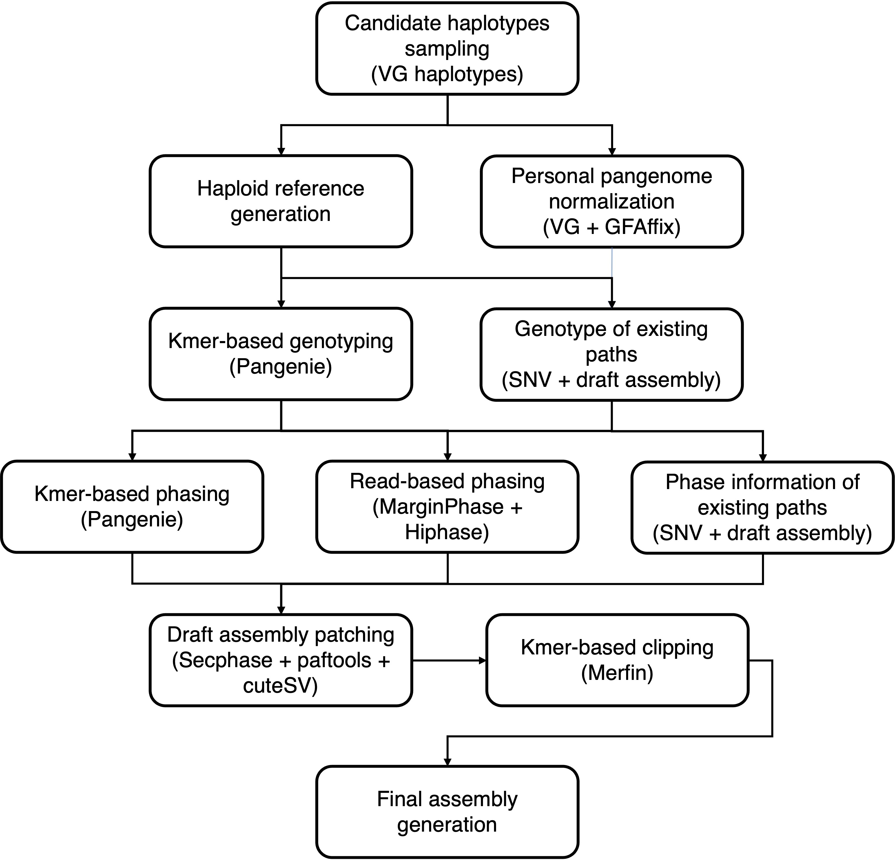

# Final diploid assembly reconstruction

This pipeline reconstructs the final diploid assembly by inferring the diploid path from pangenome.



## infer_diploid_path

### Description

- Sample the candidate haplotypes from pangenome based on kmers with VG.
- Select the haplotype path with top score as haploid reference.
- Normalize the personalized pangenome with VG and GFAffix.
- Infer the diploid path by performing integrating genotyping and phasing using information from SNV path, draft assembly path, long read and short read.
- Patch the diploid assembly by the draft assembly at structure-discordant regions.
- Clip the diploid assembly at kmer-erroneous regions.

### Requirement

- [VG](https://github.com/vgteam/vg)
- [GFAffix](https://github.com/codialab/GFAffix)
- [vcfbub](https://github.com/pangenome/vcfbub)
- [Bcftools](https://github.com/samtools/bcftools)
- [Pangenie](https://github.com/eblerjana/PanGenie)
- [MarginPhase](https://github.com/benedictpaten/marginPhase)
- [Hiphase](https://github.com/PacificBiosciences/HiPhase)
- [minimap2](https://github.com/lh3/minimap2)
- [Secphase](https://github.com/mobinasri/secphase)
- [cuteSV](https://github.com/tjiangHIT/cuteSV)
- [paftools](https://github.com/RBGKew/pypaftol)
- [Merqury](https://github.com/marbl/merqury)
- [Bedtools](https://github.com/arq5x/bedtools2)
- [Samtools](https://github.com/samtools/samtools)

### Configuration (infer_diploid_path.yaml)

The configuration file should contain:

`samples`: Specify the path to a text file listing all samples.
The file must be space-delimited, with:

- Column 1: Sample name
- Column 2: Sample sex

`sr_fastqs`: Specify the paths to the paired-end short-read FASTQ files.
Use `{sample}` as a wildcard; it will be automatically replaced with sample names from the `samples` file.

`lr_hifi_fastqs`: Specify the path(s) to PacBio HiFi long-read FASTQ files.
Use `{sample}` as a wildcard.

`lr_zmw_fastqs`: Specify the path(s) to PacBio ZMW FASTQ files.
Use `{sample}` as a wildcard.

`train_sample_list`: Path to a file listing samples used for model training.
One sample per line.

`prefix`: Prefix used for naming output files.

`hapl` _(optional)_: Path to the merged assembly haplotype file.
If omitted, the workflow will use the default:
`c7_graph_construction/graph_merge/{prefix}.merge.assembly.hapl`

`gbz` _(optional)_: Path to the merged assembly GBZ file.
If omitted, the workflow will use the default:
`c7_graph_construction/graph_merge/{prefix}.merge.assembly.gbz`

`gfa` _(optional)_: Path to the merged graph GFA file.
If omitted, the workflow will use the default:
`c7_graph_construction/graph_merge/{prefix}.nopath.gfa`

`variant_path` _(optional)_: Path to the variant path files by chromosome.
If omitted, the workflow will use the default:
`c7_graph_construction/graph_merge/{prefix}.{chr}.variant.path`

`hap1_fa` _(optional)_: Path to sample haplotype 1 assembly FASTA.
If omitted, the workflow will use the default:
`c6_draft_assembly/sample_assembly/{sample}/assembly/{sample}.hap1.fasta`

`hap2_fa` _(optional)_: Path to sample haplotype 2 assembly FASTA.
If omitted, the workflow will use the default:
`c6_draft_assembly/sample_assembly/{sample}/assembly/{sample}.hap2.fasta`

`sample_meryl` _(optional)_: Path to the sample’s meryl database (Use merylIndex to represent completed meryl directory).
If omitted, the workflow will use the default:
`c3_merge_snv/sample_meryl/{sample}/{sample}.meryl/merylIndex`

### Usage

```bash
snakemake -s Snakefile --cores 64 --jobs 64 --configfile config/infer_diploid_path.yaml --workflow-profile ./profile/config_slurm/
```

### Output
The output file should contain:
- `c8_diploid_path_infer/sample_assembly/{sample}/{sample}.{hap1,hap2}.complete_assembly.polish.clip.fasta`: Final diploid assembly of each sample
